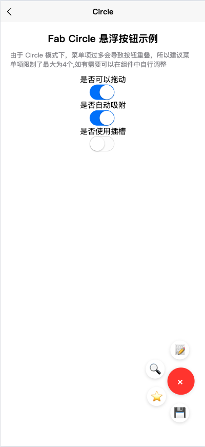
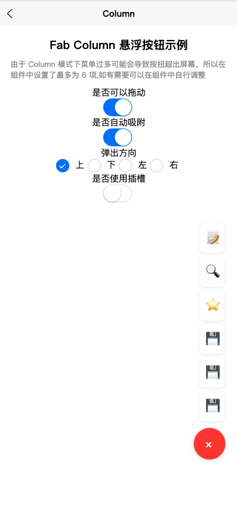

# myl-uniapp-fab

一个功能强大的 uniapp 悬浮按钮组件，支持拖拽、自动吸附、多种布局模式等特性。

## 特性

- 🚀 支持拖拽：按钮可自由拖动到屏幕任意位置
- 🔄 自动吸附：松手后自动吸附到屏幕边缘
- 📱 安全区域：自动避开顶部和底部安全区域
- 🎨 多种布局：支持环形(circle)和列式(column)两种布局模式
- 🎯 自定义菜单：支持自定义菜单项的图标和操作
- 💫 动画效果：流畅的展开/收起动画
- 🎭 插槽支持：支持自定义按钮和菜单项的内容

## 安装

将 `components/fab` 文件夹复制到你的项目中的 components 目录下。

## 使用方法

1. 在页面中引入组件：

```vue
import Fab from '@/components/fab/index.vue' export default { components: { Fab
} }
```

2. 在模板中使用：

```vue
<template>
  <fab
    :menuItems="menuItems"
    :layout="'circle'"
    :draggable="true"
    :autosorption="true"
    @select="handleSelect" />
</template>

<script>
export default {
  data() {
    return {
      menuItems: [
        { icon: "📝", action: "edit" },
        { icon: "🔍", action: "search" },
        { icon: "⭐", action: "star" },
        { icon: "💾", action: "save" },
      ],
    };
  },
  methods: {
    handleSelect(item) {
      console.log("选中的菜单项：", item);
    },
  },
};
</script>
```

## 属性说明

| 属性               | 类型    | 默认值    | 说明                                               |
| ------------------ | ------- | --------- | -------------------------------------------------- |
| position           | Array   | [10, 100] | 初始位置 [x, y]                                    |
| draggable          | Boolean | true      | 是否可拖动                                         |
| autosorption       | Boolean | true      | 是否自动吸附到边缘                                 |
| safeDistance       | Number  | 20        | 边缘安全距离（单位：rpx）                          |
| bottomSafeDistance | Number  | 120       | 底部安全距离（单位：rpx）                          |
| topSafeDistance    | Number  | 120       | 顶部安全距离（单位：rpx）                          |
| layout             | String  | 'column'  | 布局模式：'circle' 或 'column'                     |
| direction          | String  | 'top'     | 列式布局弹出方向：'top'、'bottom'、'left'、'right' |
| menuItems          | Array   | []        | 菜单项配置数组                                     |

## 事件

| 事件名 | 说明             | 回调参数               |
| ------ | ---------------- | ---------------------- |
| select | 选择菜单项时触发 | item: 选中的菜单项信息 |
| open   | 菜单展开时触发   | -                      |
| close  | 菜单收起时触发   | -                      |

## 插槽

| 插槽名      | 说明                                       |
| ----------- | ------------------------------------------ |
| main-button | 自定义主按钮内容                           |
| menu-item   | 自定义菜单项内容，作用域插槽提供 item 参数 |

## 注意事项

1. circle 布局模式下，为避免按钮重叠，建议菜单项不超过 4 个
2. 使用自动吸附功能时，按钮会自动吸附到最近的屏幕边缘
3. 可以通过 safeDistance、bottomSafeDistance 和 topSafeDistance 属性调整按钮的安全区域

## 示例





查看 `pages/example` 目录下的示例文件，了解更多使用方法：

- `circle.vue`: 环形布局示例
- `column.vue`: 列式布局示例

## License

MIT
